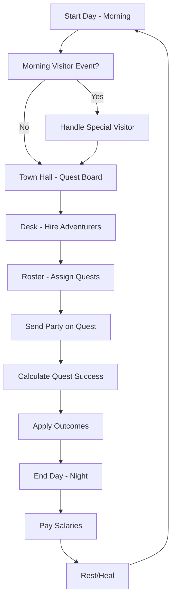
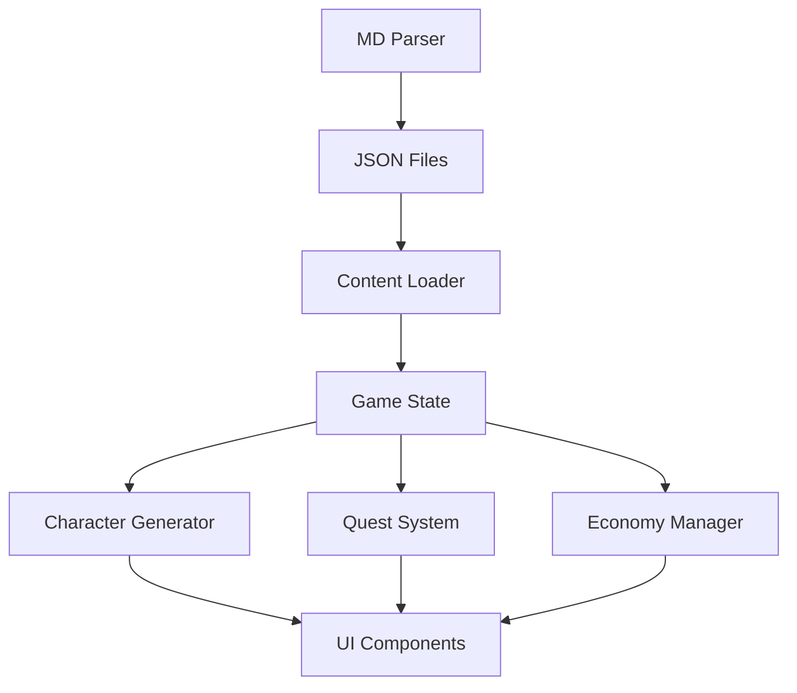

# 🏗️ Tavern Guild Master - Game Architecture Plan

**Created**: 2026-01-08  
**Source**: Based on `Initial project outline/` folder analysis  
**Purpose**: Define development priorities, system dependencies, and implementation roadmap

---

## 📊 CURRENT STATUS

### ✅ Content Complete (MVP 100%)
The `/Initial project outline/` folder contains **8 comprehensive content files** totaling ~5000 lines:

| Category | Files | Status | Quality |
|----------|-------|--------|---------|
| **Characters** | `classes.md`, `traits.md` | ✅ Complete | 13 classes, 50+ traits |
| **Quests** | `quest_registry.md` | ✅ Complete | 18 quests across all ranks |
| **Items** | `weapons.md`, `armors.md`, `consumables.md` | ✅ Complete | 24 weapons, 9 armors, consumables |
| **Locations** | `biomes.md` | ✅ Complete | 9 environments with hazards |
| **Mechanics** | `match_formula.md` | ✅ Complete | Full quest resolution algorithm |
| **Events** | `morning_visitors.md` | ✅ Complete | 7 special visitor events |
| **Economy** | `pricing.md` | ✅ Complete | Cost/reward formulas |

### 🔧 Implementation Status
- **Content Design**: ✅ 100% (implementation-ready)
- **Game Engine**: ❌ 0% (not started)
- **UI/UX**: ❌ 0% (not started)
- **Data Pipeline**: ❌ 0% (MD → JSON parser needed)

---

## 🎯 CORE GAME LOOP



### Critical Systems
1. **Morning Phase** → Visitor events (random chance)
2. **Town Hall** → Quest board refresh (rank-based spawning)
3. **Desk** → Adventurer hiring (pool management)
4. **Roster** → Equipment + assignment
5. **Quest Resolution** → Match formula calculation
6. **Night Phase** → Economy + progression

---

## 🏗️ SYSTEM ARCHITECTURE

### 1. Data Layer (Foundation)
> **Priority: CRITICAL** — Everything depends on this

```
┌─────────────────────────────────┐
│   Content Database (Static)     │
│                                  │
│ ┌──────────┐  ┌──────────┐     │
│ │ MD Files │─▶│MD Parser │     │
│ └──────────┘  └─────┬────┘     │
│                     ▼            │
│               ┌──────────┐      │
│               │   JSON   │      │
│               │  Files   │      │
│               └─────┬────┘      │
└───────────────────────┬─────────┘
                        ▼
        ┌───────────────────────────┐
        │  Game State Manager       │
        │  (Runtime Data)            │
        │                            │
        │  • Gold, Day, Reputation  │
        │  • Roster (adventurers)   │
        │  • Quest Board (available)│
        │  • Active Quests          │
        └────────────────────────────┘
```

**Required Components**:
- [ ] MD → JSON parser (build-time script)
- [ ] Content validator (check references)
- [ ] GameState class (save/load system)
- [ ] LocalStorage persistence

---

### 2. Core Mechanics Layer
> **Priority: CRITICAL** — Game logic engine

#### A. Character Generation System
**Dependencies**: `classes.md`, `traits.md`, `name_generator` (future)

```javascript
generateAdventurer(level, classPool) {
    // 1. Pick random class
    // 2. Roll for starting traits
    // 3. Calculate stats (base + growth × level)
    // 4. Determine hire cost/salary
    // 5. Generate portrait/visual tells
    return adventurer;
}
```

#### B. QuestMatchMaking System
**Dependencies**: `match_formula.md`, `quests.md`, `biomes.md`

```javascript
calculateQuestSuccess(character, quest, environment) {
    // SEE: mechanics/match_formula.md
    // 1. Base success = (char.stat / quest.req) × 60%
    // 2. Add all modifiers (class, traits, equipment, environment)
    // 3. Clamp to 5-95%
    // 4. Roll outcome (crit success, success, fail, crit fail)
    // 5. Apply consequences (gold, XP, injuries, death)
}
```

#### C. Economy System
**Dependencies**: `pricing.md`

```javascript
economyManager {
    dailyExpenses() {
        // Calculate all salaries
        // Deduct guild rent (future)
        // Apply reputation bonuses/penalties
    }
    
    questRewards(quest, outcome) {
        // Base reward × rank multiplier
        // Crit success = 2x gold
        // Freelancer cut = 40% if applicable
    }
}
```

---

### 3. UI Layer
> **Priority: HIGH** — User interface components

#### Screen Hierarchy
```
Main Menu
    ↓
┌─────────────────────┐
│  Game Dashboard     │
│  [Gold | Day | Rep] │
└──────────┬──────────┘
           │
    ┌──────┴──────┬───────────┬────────────┐
    ▼             ▼           ▼            ▼
┌────────┐  ┌─────────┐ ┌─────────┐ ┌─────────┐
│ Roster │  │Town Hall│ │  Desk   │ │  Night  │
│        │  │ (Quest  │ │ (Hire)  │ │ (Sleep) │
│ View/  │  │  Board) │ │         │ │         │
│ Equip  │  │         │ │         │ │         │
└────────┘  └─────────┘ └─────────┘ └─────────┘
     │            │           │            │
     └────────────┴───────────┴────────────┘
                  │
            Morning Events
          (Modal Overlay)
```

#### Key UI Components
- [ ] **Dashboard** → Displays gold, day, reputation
- [ ] **Quest Board** → Card-based quest display with filters
- [ ] **Desk** → Hiring interface with visual tells
- [ ] **Roster** → Character cards with stats/equipment drag-drop
- [ ] **Morning Visitor Modal** → Event dialogue system
- [ ] **Quest Assignment Modal** → Drag adventurers to quest slots

---

### 4. Event System
> **Priority: MEDIUM** — Special encounters

**Dependencies**: `morning_visitors.md`, `crown_events.md` (future)

```javascript
morningPhase() {
    const roll = Math.random();
    
    if (roll < 0.20) { // 20% daily chance
        const visitor = pickRandomVisitor();
        triggerVisitorEvent(visitor);
        // Display modal with dialogue
        // Present choices
        // Apply consequences
    }
}
```

---

### 5. Gameplay Enhancement Systems (NEW)
> **Priority: IMPLEMENTED** — Advanced gameplay features

#### A. Choice Events (Reigns-style)
**Files**: `src/events/ChoiceEventSystem.js`, `data/choice_events.js`

Binary choice events that trigger during game phases (MORNING, TOWN_HALL) with consequences affecting gold, reputation, and story flags.

```javascript
// ChoiceEventSystem provides:
checkForEvent(phase, gameState)  // Roll for events based on conditions
applyChoice(event, choiceIndex)  // Apply consequences to game state
getSaveData() / loadSaveData()   // Persistence support
```

**Features**:
- 15+ pre-defined events with probability-based triggering
- Conditional events (require minDay, minGold, story flags)
- Cooldown system prevents event spam
- Effects: gold changes, reputation changes, story flags

#### B. Travel Events (Oregon Trail-style)
**Files**: `src/narrative/NarrativeGenerator.js` (rollTravelEvents, formatTravelEventsHTML)

Random events occur during multi-day quests (2+ days), displayed in evening report.

```javascript
// NarrativeGenerator provides:
rollTravelEvents(quest, duration)     // Generate events (40% per day)
formatTravelEventsHTML(events, hero)  // Stylized display for ledger
```

**Event Types**: Positive (shortcuts, treasure), Neutral (rest events), Negative (bandits, illness)
**Weighting**: Higher-rank quests have more negative events

#### C. Death Matters (Darkest Dungeon-style)
**Files**: `src/core/GameState.js` (memorial, holdVigil, skipVigil)

Impactful death system with player choice and memorial tracking.

```javascript
// GameState new properties:
this.memorial = [];                    // Array of fallen heroes
this.dailyLog.pendingVigils = [];      // Deaths awaiting player choice

// GameState new methods:
holdVigil(heroId)   // Pay 50G, gain +5 Town Rep, honored memorial
skipVigil(heroId)   // No cost/benefit, unmarked memorial
```

**UI Components**:
- Vigil choice panel in Evening Report (💀 The Fallen section)
- Wall of the Fallen memorial in Guild Hall sidebar
- Visual distinction: 🕯️ (vigil) vs ⚰️ (no ceremony)

---

## 🚀 DEVELOPMENT ROADMAP

### 🔥 PHASE 1: Foundation (Week 1-2)
> **Goal**: Get the data flowing and core systems working

#### Sprint 1: Data Pipeline (Days 1-3)
- [ ] Create MD → JSON parser script
- [ ] Convert all 8 content files to JSON
- [ ] Build content validator (check ID references)
- [ ] Test loading JSON into memory

**Deliverable**: `data/` folder with validated JSON files

---

#### Sprint 2: Core Systems (Days 4-7)
- [ ] Build GameState manager
- [ ] Implement character generator
- [ ] Implement match formula calculator
- [ ] Add LocalStorage save/load
- [ ] **Unit tests** for all calculations

**Deliverable**: Console-based game loop (no UI)

**Test Example**:
```javascript
// Test character generation
const char = generateAdventurer(1, ['knight']);
console.log('Generated:', char);
// Verify: stats, traits, cost correct

// Test match formula
const result = calculateSuccess(char, goblinQuest);
console.log('Success rate:', result.finalChance);
// Verify: modifiers applied correctly
```

---

### 🎨 PHASE 2: Minimal Playable UI (Week 3)
> **Goal**: Make it playable with basic UI

#### Sprint 3: Core UI (Days 8-10)
- [ ] Create HTML structure with screens
- [ ] Implement Dashboard (gold/day display)
- [ ] Build Quest Board (display quests from JSON)
- [ ] Build Desk (show adventurer pool)
- [ ] Add basic click navigation

**Deliverable**: Can view quests and adventurers (read-only)

---

#### Sprint 4: Interactive Gameplay (Days 11-14)
- [ ] Implement hiring mechanic
- [ ] Add quest assignment UI
- [ ] Connect "Send on Quest" button to match formula
- [ ] Display quest results
- [ ] Add "End Day" button (advance time)

**Deliverable**: Complete core loop playable

**Manual Test**:
1. Start game → verify 350G, Day 1
2. Hire adventurer → verify cost deducted
3. Assign to quest → verify UI updates
4. Send on quest → verify result displayed
5. End day → verify gold/day changes

---

### ⚙️ PHASE 3: Polish & Features (Week 4)
> **Goal**: Add depth and juice

#### Sprint 5: Equipment & Traits (Days 15-17)
- [ ] Implement equipment system (weapons.md, armors.md)
- [ ] Add gifting UI (drag items to adventurers)
- [ ] Display trait visual tells in Desk UI
- [ ] Add injury system
- [ ] Show injury status in Roster

---

#### Sprint 6: Events & Progression (Days 18-21)
- [ ] Implement Morning Visitor system
- [ ] Add event modal UI
- [ ] Implement XP/leveling
- [ ] Add reputation tracking
- [ ] Create save/load UI

**Deliverable**: Feature-complete MVP

---

### 🏆 PHASE 4: Content Expansion (Post-MVP)
> **Optional**: Add remaining content

- [ ] Add 12+ new classes
- [ ] Expand quests to 70+ (target pool)
- [ ] Implement name generator (1000+ names)
- [ ] Add guild upgrade system
- [ ] Create quest chains (multi-quest stories)
- [ ] Add magical items
- [ ] Implement Crown quota events

---

## 📋 TECHNICAL DECISIONS

### Technology Stack
- **Framework**: Vanilla HTML/CSS/JS (or React/Vue if complexity grows)
- **Build Tool**: Node.js for MD → JSON conversion
- **Storage**: LocalStorage (upgrade to IndexedDB later)
- **Testing**: Jest for unit tests

### File Structure
```
tavern-guild-master/
├── data/                    # JSON files (generated from MD)
│   ├── classes.json
│   ├── traits.json
│   ├── quests.json
│   └── ...
├── src/
│   ├── core/
│   │   ├── GameState.js
│   │   ├── CharacterGenerator.js
│   │   ├── MatchFormula.js
│   │   └── EconomyManager.js
│   ├── ui/
│   │   ├── Dashboard.js
│   │   ├── QuestBoard.js
│   │   ├── Desk.js
│   │   └── Roster.js
│   ├── events/
│   │   └── MorningVisitors.js
│   └── utils/
│       └── ContentLoader.js
├── tools/
│   └── md-to-json.js        # Conversion script
├── content/                 # Original MD files
│   └── (Initial project outline)
└── index.html
```

---

## ⚠️ CRITICAL DEPENDENCIES

### System Dependencies


**Build Order** (MUST follow this):
1. MD Parser → JSON Files
2. Content Loader (load JSON into memory)
3. GameState (data structure)
4. Core Logic (character gen, match formula, economy)
5. UI Components
6. Event System

---

## 🎯 WHAT TO BUILD NOW

### Immediate Priority (This Week)
1. **MD → JSON Parser** (Day 1)
   - Convert all `.md` files to structured JSON
   - Validate cross-references

2. **Game State Manager** (Day 2)
   - Create save/load system
   - Define data structures (see `DEVELOPER_HANDOVER_GUIDE.md`)

3. **Character Generator** (Day 3)
   - Implement class selection
   - Roll for traits
   - Calculate stats

4. **Match Formula** (Day 4-5)
   - Implement exact algorithm from `match_formula.md`
   - Unit test all edge cases

5. **Basic UI** (Day 6-7)
   - Dashboard + Quest Board
   - Desk (hiring)
   - Roster (viewing)

---

## 🔮 WHAT CAN WAIT

### Post-MVP Features
- Guild upgrades system
- Name generator (use placeholder names for now)
- Quest chains / storylines
- Magical items (focus on basic items first)
- Crown quota events
- Advanced save system (cloud sync)
- Multiplayer / leaderboards

### Nice-to-Have Polish
- Animations (fade-ins, card flips)
- Sound effects / music
- Portrait generation (use placeholder icons)
- Advanced filters (quest board sorting)
- Statistics tracking (total quests completed, etc.)

---

## 🚧 KNOWN RISKS

| Risk | Impact | Mitigation |
|------|--------|------------|
| **Match formula too complex** | HIGH | Build incrementally, test each modifier |
| **Content imbalance** | MEDIUM | Playtest early, adjust numbers in JSON |
| **State management chaos** | HIGH | Use strict data structures, validate on load |
| **Performance (too many calculations)** | LOW | Profile later, optimize if needed |
| **Scope creep** | HIGH | **STICK TO MVP ROADMAP** |

---

## ✅ SUCCESS METRICS (MVP)

### Minimum Viable Product Checklist
- [ ] Can hire adventurers from pool
- [ ] Can view quest board
- [ ] Can assign adventurers to quests
- [ ] Match formula calculates correctly
- [ ] Quest outcomes displayed (success/fail)
- [ ] Gold/day progression works
- [ ] Can end day and continue next day
- [ ] Save/load works (LocalStorage)
- [ ] At least 5 playable classes
- [ ] At least 10 quests available

### "It Feels Like a Game" Checklist
- [ ] Morning visitor events trigger randomly
- [ ] Traits have visible gameplay impact
- [ ] Equipment bonuses are noticeable
- [ ] Injuries affect performance
- [ ] Death feels consequential
- [ ] Economy forces tough choices (can't hire everyone)

---

## 📚 REFERENCE DOCUMENTS

### Essential Reading (In Order)
1. [`Initial project outline/DEVELOPER_HANDOVER_GUIDE.md`](file:///c:/Users/farha/Anti%20PROJECTS/Tavern%20Guild%20Master/Initial%20project%20outline/DEVELOPER_HANDOVER_GUIDE.md) — Data structures and architecture warnings
2. [`Initial project outline/mechanics/match_formula.md`](file:///c:/Users/farha/Anti%20PROJECTS/Tavern%20Guild%20Master/Initial%20project%20outline/mechanics/match_formula.md) — Complete quest calculation algorithm
3. [`Initial project outline/characters/classes.md`](file:///c:/Users/farha/Anti%20PROJECTS/Tavern%20Guild%20Master/Initial%20project%20outline/characters/classes.md) — All character classes and traits
4. [`Initial project outline/README.md`](file:///c:/Users/farha/Anti%20PROJECTS/Tavern%20Guild%20Master/Initial%20project%20outline/README.md) — Content overview

---

## 🎓 NEXT STEPS

### For Developers
1. Read the [DEVELOPER_HANDOVER_GUIDE.md](file:///c:/Users/farha/Anti%20PROJECTS/Tavern%20Guild%20Master/Initial%20project%20outline/DEVELOPER_HANDOVER_GUIDE.md)
2. Start with **Phase 1, Sprint 1** (MD Parser)
3. Don't build UI first — build engine logic first
4. Test each system in console before adding UI

### For Designers
1. Review content files for balance
2. Create placeholder art assets (character portraits, quest icons)
3. Design UI mockups for main screens
4. Write additional flavor text

### For Project Managers
1. Set up task tracking (GitHub Projects, Trello, etc.)
2. Assign sprints from roadmap
3. Schedule weekly playtesting sessions
4. Track scope creep ruthlessly

---

**Status**: 🟢 Ready for Development  
**Confidence**: HIGH — All content is complete and implementation-ready  
**Estimated Timeline**: 3-4 weeks to MVP

**Let's build this! 🏰⚔️**
